# BIOS 512 Final Course Project - Suzi Callis

## 1. Dataset
Dataset: [Dogs Dataset – 3,000 Records](https://www.kaggle.com/datasets/waqi786/dogs-dataset-3000-records)  
Rows: 3,000  
Columns: 5 

### 1.1 Dataset Description

The dataset contains **3,000 observations** and **five variables** describing individual dogs.  

**Numerical Variables:**  
- *Age (Years)* represents each dog’s age, ranging from 1 to 14 years.  
- *Weight (kg)* represents the dog’s body weight, ranging from 5 to 59 kilograms.  
Both variables are continuous and contain no missing values.  

**Categorical Variables:**  
- *Breed* includes 53 distinct dog breeds.  
- *Color* includes 16 different coat color categories.  
- *Gender* indicates the dog’s sex, with two possible values: *Male* and *Female.*  

No missing values are present in the dataset. Minor inconsistencies in categorical formatting (e.g., capitalization of color names) may require standardization prior to analysis.


### 1.2 Codebook

| Column Name    | Type       | Description / Summary                                      | Missing Values | Unique Values |
|----------------|------------|------------------------------------------------------------|----------------|---------------|
| **Breed**      | character  | Dog breed. Examples: “Airedale Terrier”, “Labrador Retriever”, “Jack Russell Terrier”, etc. | 0 | 53 |
| **Age (Years)**| numeric    | Age of the dog in years. Range: 1–14, Median: 8, Mean: 7.5 | 0 | 14 |
| **Weight (kg)**| numeric    | Weight of the dog in kilograms. Range: 5–59, Median: 33, Mean: 32.1 | 0 | 55 |
| **Color**      | character  | Primary color(s) of the dog. Examples: “White”, “Tan”, “Spotted”, “Bicolor”, etc. | 0 | 10 |
| **Gender**     | character  | Gender of the dog. Values: “Male”, “Female” | 0 | 2 |


## 2. Data Analysis

### 2.1 Summary of Data


```R
library(tidyverse)
dogs <- read.csv("dogs_dataset.csv")
summary(dogs)

# Check for missing values
sapply(dogs, function(x) sum(is.na(x)))

# Rename columns
names(dogs) <- c("Breed", "Age", "Weight", "Color", "Gender")
```


        Breed            Age..Years.      Weight..kg.       Color          
     Length:3000        Min.   : 1.000   Min.   : 5.00   Length:3000       
     Class :character   1st Qu.: 4.000   1st Qu.:19.00   Class :character  
     Mode  :character   Median : 8.000   Median :33.00   Mode  :character  
                        Mean   : 7.499   Mean   :32.06                     
                        3rd Qu.:11.000   3rd Qu.:45.00                     
                        Max.   :14.000   Max.   :59.00                     
        Gender         
     Length:3000       
     Class :character  
     Mode  :character  
                       
                       
                       


<style>
.dl-inline {width: auto; margin:0; padding: 0}
.dl-inline>dt, .dl-inline>dd {float: none; width: auto; display: inline-block}
.dl-inline>dt::after {content: ":\0020"; padding-right: .5ex}
.dl-inline>dt:not(:first-of-type) {padding-left: .5ex}
</style><dl class=dl-inline><dt>Breed</dt><dd>0</dd><dt>Age..Years.</dt><dd>0</dd><dt>Weight..kg.</dt><dd>0</dd><dt>Color</dt><dd>0</dd><dt>Gender</dt><dd>0</dd></dl>


### 2.2 Color


```R
library(tidyverse)
color_summary <- dogs %>%
  group_by(Color) %>%
  summarise(Count = n()) %>%
  arrange(desc(Count))
color_summary
```


<table class="dataframe">
<caption>A tibble: 16 × 2</caption>
<thead>
	<tr><th scope=col>Color</th><th scope=col>Count</th></tr>
	<tr><th scope=col>&lt;chr&gt;</th><th scope=col>&lt;int&gt;</th></tr>
</thead>
<tbody>
	<tr><td>Black and White</td><td>205</td></tr>
	<tr><td>Bicolor        </td><td>200</td></tr>
	<tr><td>Brindle        </td><td>200</td></tr>
	<tr><td>Merle          </td><td>199</td></tr>
	<tr><td>Sable          </td><td>199</td></tr>
	<tr><td>Black and Tan  </td><td>193</td></tr>
	<tr><td>Blue           </td><td>191</td></tr>
	<tr><td>Spotted        </td><td>191</td></tr>
	<tr><td>Brown          </td><td>189</td></tr>
	<tr><td>Red            </td><td>185</td></tr>
	<tr><td>Black          </td><td>184</td></tr>
	<tr><td>White          </td><td>182</td></tr>
	<tr><td>Gray           </td><td>179</td></tr>
	<tr><td>Tan            </td><td>173</td></tr>
	<tr><td>Tricolor       </td><td>166</td></tr>
	<tr><td>Cream          </td><td>164</td></tr>
</tbody>
</table>


#### 2.2.1 Combine "Black and White" and "Black and Tan" into "Bicolor" and update counts


```R
dogs <- dogs %>%
  mutate(Color = if_else(Color %in% c("Black and White", "Black and Tan"), "Bicolor", Color))
dogs %>%
  count(Color, name = "Count") %>%
  arrange(desc(Count))
```


<table class="dataframe">
<caption>A data.frame: 14 × 2</caption>
<thead>
	<tr><th scope=col>Color</th><th scope=col>Count</th></tr>
	<tr><th scope=col>&lt;chr&gt;</th><th scope=col>&lt;int&gt;</th></tr>
</thead>
<tbody>
	<tr><td>Bicolor </td><td>598</td></tr>
	<tr><td>Brindle </td><td>200</td></tr>
	<tr><td>Merle   </td><td>199</td></tr>
	<tr><td>Sable   </td><td>199</td></tr>
	<tr><td>Blue    </td><td>191</td></tr>
	<tr><td>Spotted </td><td>191</td></tr>
	<tr><td>Brown   </td><td>189</td></tr>
	<tr><td>Red     </td><td>185</td></tr>
	<tr><td>Black   </td><td>184</td></tr>
	<tr><td>White   </td><td>182</td></tr>
	<tr><td>Gray    </td><td>179</td></tr>
	<tr><td>Tan     </td><td>173</td></tr>
	<tr><td>Tricolor</td><td>166</td></tr>
	<tr><td>Cream   </td><td>164</td></tr>
</tbody>
</table>


### 2.3 Breed


```R
breed_counts <- dogs %>%
  count(Breed, sort = TRUE)
head(breed_counts, 53)
```


<table class="dataframe">
<caption>A data.frame: 53 × 2</caption>
<thead>
	<tr><th></th><th scope=col>Breed</th><th scope=col>n</th></tr>
	<tr><th></th><th scope=col>&lt;chr&gt;</th><th scope=col>&lt;int&gt;</th></tr>
</thead>
<tbody>
	<tr><th scope=row>1</th><td>Rottweiler                   </td><td>118</td></tr>
	<tr><th scope=row>2</th><td>French Bulldog               </td><td> 70</td></tr>
	<tr><th scope=row>3</th><td>Pekingese                    </td><td> 68</td></tr>
	<tr><th scope=row>4</th><td>Pembroke Welsh Corgi         </td><td> 67</td></tr>
	<tr><th scope=row>5</th><td>Doberman Pinscher            </td><td> 66</td></tr>
	<tr><th scope=row>6</th><td>Weimaraner                   </td><td> 66</td></tr>
	<tr><th scope=row>7</th><td>Pug                          </td><td> 65</td></tr>
	<tr><th scope=row>8</th><td>Bichon Frise                 </td><td> 64</td></tr>
	<tr><th scope=row>9</th><td>Cavalier King Charles Spaniel</td><td> 64</td></tr>
	<tr><th scope=row>10</th><td>Chinese Shar-Pei             </td><td> 64</td></tr>
	<tr><th scope=row>11</th><td>Vizsla                       </td><td> 64</td></tr>
	<tr><th scope=row>12</th><td>Poodle                       </td><td> 61</td></tr>
	<tr><th scope=row>13</th><td>Whippet                      </td><td> 60</td></tr>
	<tr><th scope=row>14</th><td>Bloodhound                   </td><td> 59</td></tr>
	<tr><th scope=row>15</th><td>Cocker Spaniel               </td><td> 59</td></tr>
	<tr><th scope=row>16</th><td>Dachshund                    </td><td> 59</td></tr>
	<tr><th scope=row>17</th><td>Border Collie                </td><td> 57</td></tr>
	<tr><th scope=row>18</th><td>Bernese Mountain Dog         </td><td> 56</td></tr>
	<tr><th scope=row>19</th><td>Lhasa Apso                   </td><td> 56</td></tr>
	<tr><th scope=row>20</th><td>Samoyed                      </td><td> 56</td></tr>
	<tr><th scope=row>21</th><td>Airedale Terrier             </td><td> 55</td></tr>
	<tr><th scope=row>22</th><td>Alaskan Malamute             </td><td> 55</td></tr>
	<tr><th scope=row>23</th><td>Beagle                       </td><td> 55</td></tr>
	<tr><th scope=row>24</th><td>Bull Terrier                 </td><td> 55</td></tr>
	<tr><th scope=row>25</th><td>Bulldog                      </td><td> 55</td></tr>
	<tr><th scope=row>26</th><td>Dogo Argentino               </td><td> 55</td></tr>
	<tr><th scope=row>27</th><td>Havanese                     </td><td> 55</td></tr>
	<tr><th scope=row>28</th><td>Irish Setter                 </td><td> 55</td></tr>
	<tr><th scope=row>29</th><td>Jack Russell Terrier         </td><td> 55</td></tr>
	<tr><th scope=row>30</th><td>Miniature Schnauzer          </td><td> 55</td></tr>
	<tr><th scope=row>31</th><td>Great Dane                   </td><td> 54</td></tr>
	<tr><th scope=row>32</th><td>Saint Bernard                </td><td> 54</td></tr>
	<tr><th scope=row>33</th><td>Boston Terrier               </td><td> 53</td></tr>
	<tr><th scope=row>34</th><td>German Shepherd              </td><td> 53</td></tr>
	<tr><th scope=row>35</th><td>Siberian Husky               </td><td> 53</td></tr>
	<tr><th scope=row>36</th><td>Yorkshire Terrier            </td><td> 53</td></tr>
	<tr><th scope=row>37</th><td>Boxer                        </td><td> 52</td></tr>
	<tr><th scope=row>38</th><td>Chesapeake Bay Retriever     </td><td> 52</td></tr>
	<tr><th scope=row>39</th><td>Labrador Retriever           </td><td> 52</td></tr>
	<tr><th scope=row>40</th><td>Maltese                      </td><td> 52</td></tr>
	<tr><th scope=row>41</th><td>Shih Tzu                     </td><td> 52</td></tr>
	<tr><th scope=row>42</th><td>Akita                        </td><td> 51</td></tr>
	<tr><th scope=row>43</th><td>Australian Shepherd          </td><td> 51</td></tr>
	<tr><th scope=row>44</th><td>Shetland Sheepdog            </td><td> 50</td></tr>
	<tr><th scope=row>45</th><td>Basenji                      </td><td> 49</td></tr>
	<tr><th scope=row>46</th><td>Chihuahua                    </td><td> 48</td></tr>
	<tr><th scope=row>47</th><td>Papillon                     </td><td> 48</td></tr>
	<tr><th scope=row>48</th><td>Pomeranian                   </td><td> 48</td></tr>
	<tr><th scope=row>49</th><td>West Highland White Terrier  </td><td> 48</td></tr>
	<tr><th scope=row>50</th><td>Schnauzer                    </td><td> 45</td></tr>
	<tr><th scope=row>51</th><td>Shiba Inu                    </td><td> 45</td></tr>
	<tr><th scope=row>52</th><td>Belgian Malinois             </td><td> 44</td></tr>
	<tr><th scope=row>53</th><td>Golden Retriever             </td><td> 44</td></tr>
</tbody>
</table>


### 2.3 Gender


```R
gender_counts <- dogs %>%
  count(Gender)
gender_counts
```


<table class="dataframe">
<caption>A data.frame: 2 × 2</caption>
<thead>
	<tr><th scope=col>Gender</th><th scope=col>n</th></tr>
	<tr><th scope=col>&lt;chr&gt;</th><th scope=col>&lt;int&gt;</th></tr>
</thead>
<tbody>
	<tr><td>Female</td><td>1520</td></tr>
	<tr><td>Male  </td><td>1480</td></tr>
</tbody>
</table>


## 3. Figures

### 3.1 Figure 1: Age and Weight Distribution


```R
library(ggplot2)
ggplot(dogs, aes(x = Age)) +
  geom_histogram(binwidth = 1, fill = "skyblue", color = "black") +
  theme_minimal() +
  labs(title = "Figure 1a: Distribution of Dog Ages (Years)", x = "Age (Years)", y = "Count")

ggplot(dogs, aes(x = Weight)) +
  geom_histogram(binwidth = 5, fill = "lightgreen", color = "black") +
  theme_minimal() +
  labs(title = "Figure 1b: Distribution of Dog Weights (kg)", x = "Weight (kg)", y = "Count")
```


    
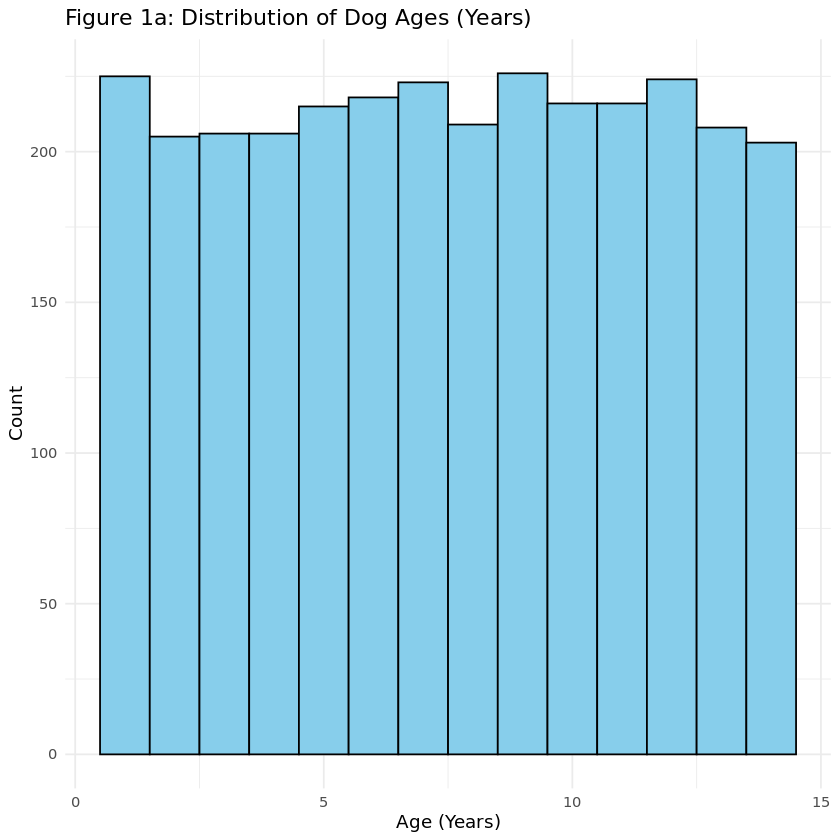
    


    
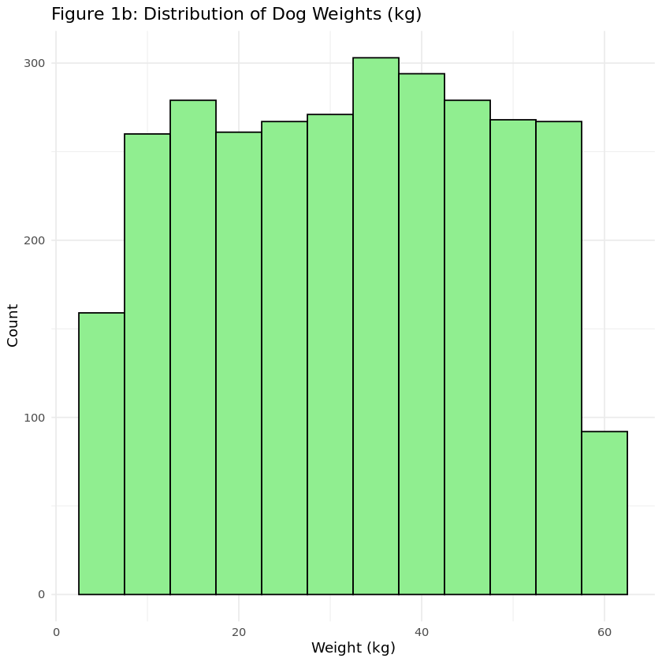
    


### 3.2 Figure 2: Age vs Weight Scatterplot


```R
ggplot(dogs, aes(x = Age, y = Weight)) +
  geom_point(size = 3, color = "blue") +
  geom_smooth(method = "lm", se = TRUE, color = "red") +
  theme_minimal() +
  labs(
    title = "Relationship Between Age and Weight",
    x = "Age (years)",
    y = "Weight (kg)"
  )
```

    `geom_smooth()` using formula = 'y ~ x'


    
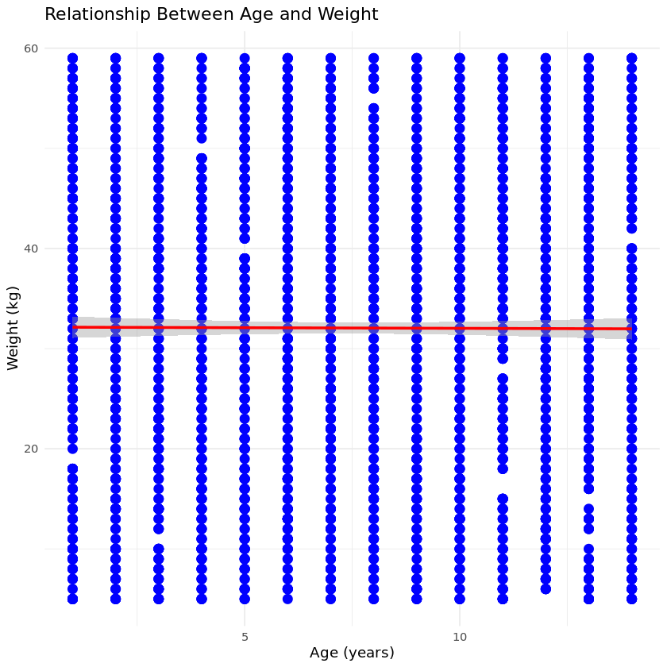
    


### 3.3 Figure 3: PCA on numeric variables (Age and Weight) to visualize breed, color, and gender patterns


```R
# Load libraries
library(dplyr)
library(ggplot2)
library(tibble)
library(Rtsne)

# 1. Scale Age and Weight
dogs_scaled <- dogs %>%
  mutate(across(c(Age, Weight), ~ as.numeric(scale(.))))
head(dogs_scaled)

# 2. Run PCA
PCA <- prcomp(dogs_scaled %>% select(Age, Weight), center = TRUE, scale. = TRUE)
summary(PCA)

# Optional: PCA rotation matrix
PCA_rotationmatrix <- solve(PCA$rotation)
head(PCA_rotationmatrix)

# 3. Create PCA score data frames with categorical variables
pca_scores <- as_tibble(PCA$x) %>%
  mutate(
    Breed  = dogs$Breed,
    Gender = dogs$Gender,
    Color  = dogs$Color
  )

# 4. Define a reusable plotting function (modern syntax)
plot_pca <- function(data, color_var, plot_title) {
  ggplot(data, aes(x = PC1, y = PC2, color = {{ color_var }})) +
    geom_point(alpha = 0.7, size = 3) +
    theme_minimal(base_size = 14) +
    labs(title = plot_title, color = deparse(substitute(color_var))) +
    theme(plot.title = element_text(hjust = 0.5, face = "bold"))
}

# 5. Generate plots
plot_gender <- plot_pca(pca_scores, Gender, "Figure 3a: PCA of Dogs Dataset (Gender)")
plot_color  <- plot_pca(pca_scores, Color,  "Figure 3b: PCA of Dogs Dataset (Color)")
plot_breed  <- plot_pca(pca_scores, Breed,  "Figure 3c: PCA of Dogs Dataset (Breed)") +
  theme(
    legend.position = "bottom",
    legend.text = element_text(size = 6),
    legend.title = element_text(size = 8)
  ) +
  guides(color = guide_legend(ncol = 4))

# 6. Display plots
print(plot_gender)
print(plot_color)
print(plot_breed)
```


<table class="dataframe">
<caption>A data.frame: 6 × 5</caption>
<thead>
	<tr><th></th><th scope=col>Breed</th><th scope=col>Age</th><th scope=col>Weight</th><th scope=col>Color</th><th scope=col>Gender</th></tr>
	<tr><th></th><th scope=col>&lt;chr&gt;</th><th scope=col>&lt;dbl&gt;</th><th scope=col>&lt;dbl&gt;</th><th scope=col>&lt;chr&gt;</th><th scope=col>&lt;chr&gt;</th></tr>
</thead>
<tbody>
	<tr><th scope=row>1</th><td>Airedale Terrier    </td><td> 1.3713971</td><td> 0.1881396</td><td>White  </td><td>Male  </td></tr>
	<tr><th scope=row>2</th><td>Jack Russell Terrier</td><td> 0.6234983</td><td> 0.7000262</td><td>Tan    </td><td>Female</td></tr>
	<tr><th scope=row>3</th><td>Dogo Argentino      </td><td>-1.3708985</td><td>-1.0275909</td><td>Spotted</td><td>Female</td></tr>
	<tr><th scope=row>4</th><td>Labrador Retriever  </td><td> 0.3741987</td><td> 1.5958276</td><td>Bicolor</td><td>Male  </td></tr>
	<tr><th scope=row>5</th><td>French Bulldog      </td><td> 1.1220975</td><td> 0.4440829</td><td>Spotted</td><td>Male  </td></tr>
	<tr><th scope=row>6</th><td>French Bulldog      </td><td> 0.3741987</td><td>-1.5394775</td><td>Bicolor</td><td>Female</td></tr>
</tbody>
</table>


    Importance of components:
                              PC1    PC2
    Standard deviation     1.0016 0.9984
    Proportion of Variance 0.5016 0.4985
    Cumulative Proportion  0.5016 1.0000


<table class="dataframe">
<caption>A matrix: 2 × 2 of type dbl</caption>
<thead>
	<tr><th></th><th scope=col>Age</th><th scope=col>Weight</th></tr>
</thead>
<tbody>
	<tr><th scope=row>PC1</th><td>-0.7071068</td><td> 0.7071068</td></tr>
	<tr><th scope=row>PC2</th><td>-0.7071068</td><td>-0.7071068</td></tr>
</tbody>
</table>


    
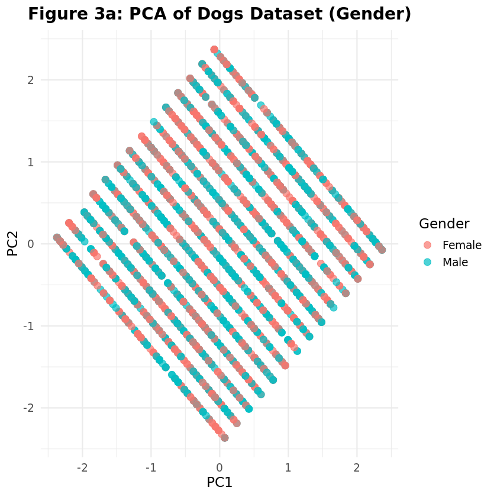
    


    

    


    
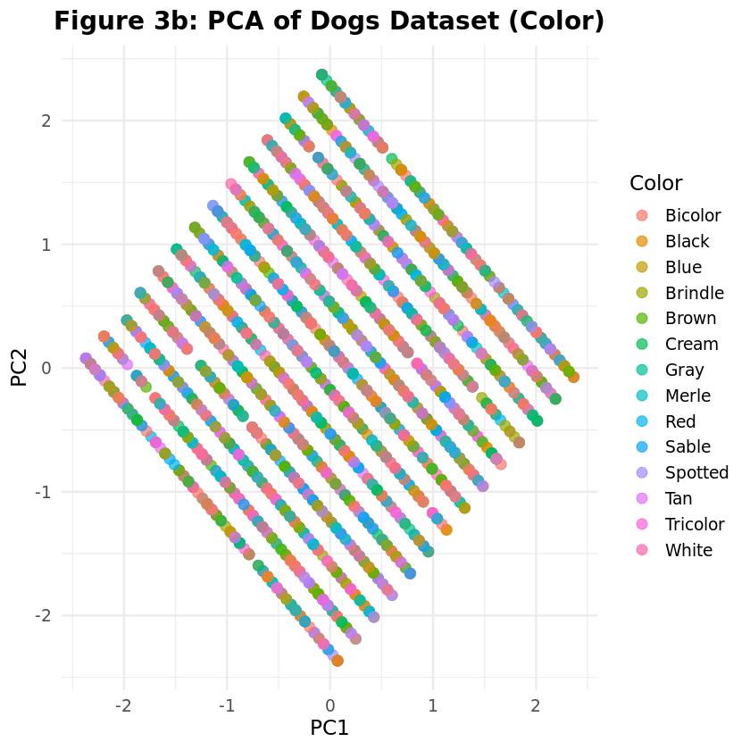
    


### 3.4 Figure 4: t-SNE on numeric variables (Age and Weight) to visualize breed, color, and gender patterns


```R
# Load libraries
library(dplyr)
library(ggplot2)
library(tibble)
library(Rtsne)

# 1. Prepare t-SNE input
tsne_input <- dogs %>%
  select(Age, Weight) %>%
  mutate(
    Age = Age + rnorm(n(), 0, 0.01),
    Weight = Weight + rnorm(n(), 0, 0.01)
  )

# 2. Set seed for reproducibility
set.seed(123)

# 3. Run t-SNE
tsne_result <- Rtsne(
  tsne_input, 
  dims = 2, 
  perplexity = 30, 
  verbose = TRUE, 
  check_duplicates = FALSE
)

# 4. Convert t-SNE output to tibble and add categorical variables
tsne_df <- as_tibble(tsne_result$Y, .name_repair = NULL) %>%
  setNames(c("tSNE1", "tSNE2")) %>%
  mutate(
    Breed = dogs$Breed,
    Color = dogs$Color,
    Gender = dogs$Gender
  )

# 5. Define plotting function (modern syntax)
plot_tsne <- function(data, color_var, plot_title) {
  ggplot(data, aes(x = tSNE1, y = tSNE2, color = {{ color_var }})) +
    geom_point(alpha = 0.7, size = 2) +
    theme_minimal(base_size = 14) +
    labs(title = plot_title, color = deparse(substitute(color_var))) +
    theme(
      plot.title = element_text(hjust = 0.5, face = "bold"),
      legend.position = "bottom"
    )
}

# 6. Create plots
plot_color <- plot_tsne(tsne_df, Color, "Figure 4a: t-SNE of Dogs Dataset (Color)")
plot_gender <- plot_tsne(tsne_df, Gender, "Figure 4b: t-SNE of Dogs Dataset (Gender)")
plot_breed <- plot_tsne(tsne_df, Breed, "Figure 4c: t-SNE of Dogs Dataset (Breed)") +
  theme(
    legend.position = "bottom",
    legend.text = element_text(size = 6),
    legend.title = element_text(size = 8)
  ) +
  guides(color = guide_legend(ncol = 4))

# 7. Display plots
print(plot_color)
print(plot_gender)
print(plot_breed)
```

    Performing PCA
    Read the 3000 x 2 data matrix successfully!
    OpenMP is working. 1 threads.
    Using no_dims = 2, perplexity = 30.000000, and theta = 0.500000
    Computing input similarities...
    Building tree...
    Done in 0.16 seconds (sparsity = 0.032730)!
    Learning embedding...
    Iteration 50: error is 78.613851 (50 iterations in 0.30 seconds)
    Iteration 100: error is 65.061019 (50 iterations in 0.31 seconds)
    Iteration 150: error is 63.197973 (50 iterations in 0.31 seconds)
    Iteration 200: error is 62.348875 (50 iterations in 0.33 seconds)
    Iteration 250: error is 61.761709 (50 iterations in 0.34 seconds)
    Iteration 300: error is 1.428075 (50 iterations in 0.32 seconds)
    Iteration 350: error is 1.047993 (50 iterations in 0.32 seconds)
    Iteration 400: error is 0.878324 (50 iterations in 0.33 seconds)
    Iteration 450: error is 0.793905 (50 iterations in 0.33 seconds)
    Iteration 500: error is 0.747589 (50 iterations in 0.34 seconds)
    Iteration 550: error is 0.715797 (50 iterations in 0.33 seconds)
    Iteration 600: error is 0.697966 (50 iterations in 0.33 seconds)
    Iteration 650: error is 0.686251 (50 iterations in 0.33 seconds)
    Iteration 700: error is 0.677863 (50 iterations in 0.33 seconds)
    Iteration 750: error is 0.670449 (50 iterations in 0.34 seconds)
    Iteration 800: error is 0.665923 (50 iterations in 0.33 seconds)
    Iteration 850: error is 0.661256 (50 iterations in 0.33 seconds)
    Iteration 900: error is 0.657288 (50 iterations in 0.34 seconds)
    Iteration 950: error is 0.653052 (50 iterations in 0.33 seconds)
    Iteration 1000: error is 0.648127 (50 iterations in 0.34 seconds)
    Fitting performed in 6.57 seconds.


    
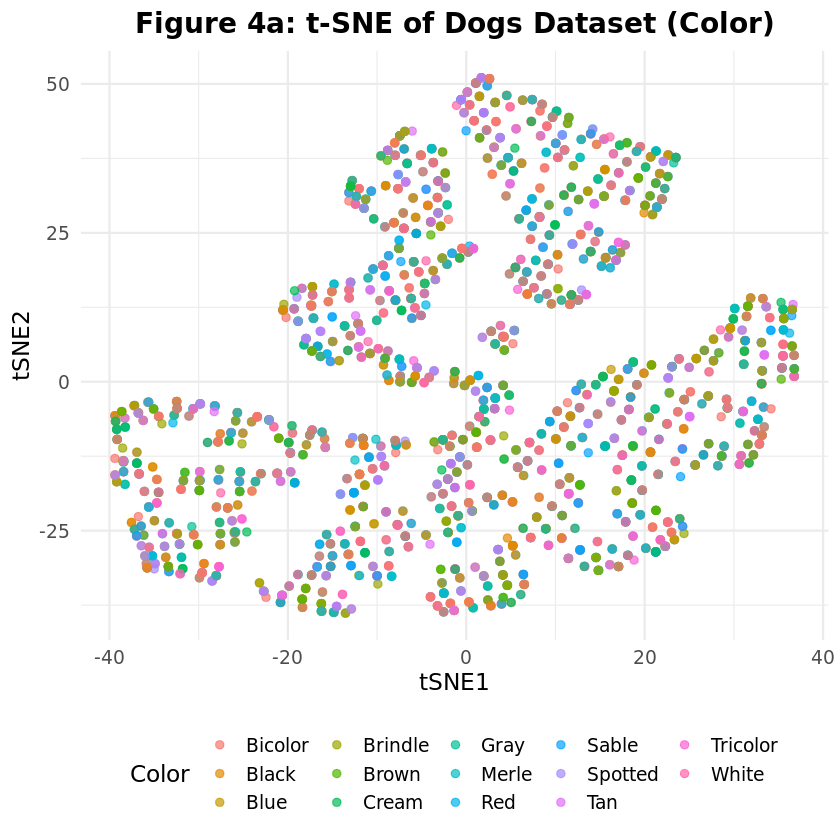
    


    
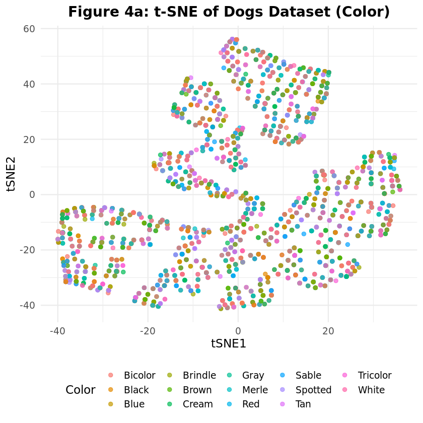
    


    
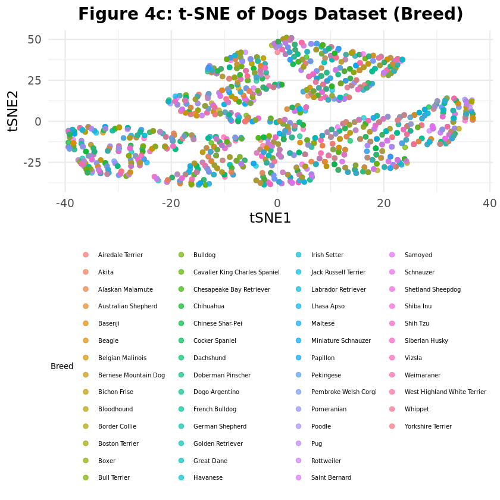
    


### 3.5 Figure 5: K-means


```R
# 1. Prepare the data matrix for k-means
dogs_matrix <- dogs %>%
  select(Age, Weight) %>%   # only numeric columns
  as.matrix()

# 2. Run k-means with 3 clusters (adjust centers as needed)
set.seed(123)  # for reproducibility
kmeans_results <- kmeans(dogs_matrix, centers = 3)

# 3. Inspect the cluster centers
print(kmeans_results$centers)

# 4. Optionally, add cluster assignments back to the dogs dataframe
dogs_clustered <- dogs %>%
  mutate(Cluster = kmeans_results$cluster)

# 5. Quick plot of Age vs Weight colored by cluster
library(ggplot2)
ggplot(dogs_clustered, aes(x = Age, y = Weight, color = factor(Cluster))) +
  geom_point(size = 2, alpha = 0.7) +
  theme_minimal() +
  labs(title = "K-means Clustering of Dogs", color = "Cluster")
```

           Age   Weight
    1 7.500525 50.37775
    2 7.455179 13.94622
    3 7.539789 32.75839


    
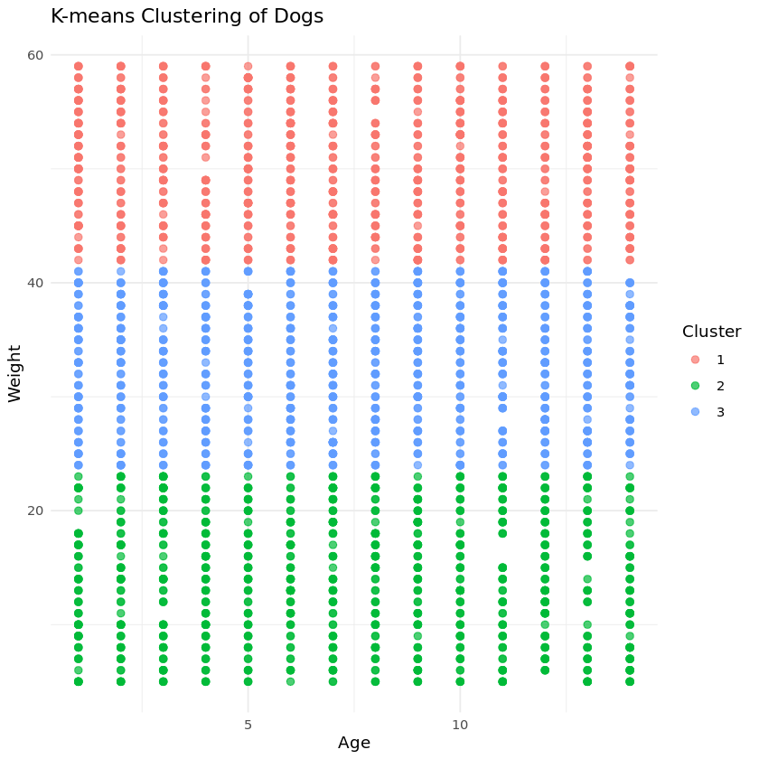
    


### 3.6 Figure 6: Linear Regression Analysis of Dog Weight by Age, Breed, Color, and Gender


```R
# 1. Optional: Scale numeric columns (Age and Weight)
scale <- function(a) {
  (a - min(a)) / (max(a) - min(a))
}

dogs_scaled <- dogs %>%
  mutate(
    Age = scale(Age),
    Weight = scale(Weight)
  )

# 2. Train/test split
set.seed(123)
train <- runif(nrow(dogs_scaled)) < 0.75
test <- !train

# 3. Define the formula
f <- Weight ~ Age + Breed + Color + Gender

# 4. Fit the linear regression on the training set
m <- lm(f, data = dogs_scaled[train, ])
summary(m)

# 5. Predict on the test set
dogs_test <- dogs_scaled[test, ] %>%
  mutate(Weight_pred = predict(m, newdata = dogs_scaled[test, ]))

# 6. Plot Actual vs Predicted
ggplot(dogs_test, aes(x = Weight, y = Weight_pred)) +
  geom_point(alpha = 0.5) +
  geom_abline(slope = 1, intercept = 0, color = "red") +
  labs(title = "Figure 6a: Actual vs Predicted Dog Weight",
       x = "Actual Weight",
       y = "Predicted Weight")

# 7. Plot Residuals vs Predicted
ggplot(dogs_test, aes(x = Weight_pred, y = Weight - Weight_pred)) +
  geom_point(alpha = 0.5) +
  geom_hline(yintercept = 0, color = "red") +
  labs(title = "Figure 6b: Residuals vs Predicted Weight",
       x = "Predicted Weight",
       y = "Residuals")
```


    
    Call:
    lm(formula = f, data = dogs_scaled[train, ])
    
    Residuals:
         Min       1Q   Median       3Q      Max 
    -0.59632 -0.25276  0.01058  0.23339  0.60430 
    
    Coefficients:
                                         Estimate Std. Error t value Pr(>|t|)    
    (Intercept)                         0.5012248  0.0468180  10.706   <2e-16 ***
    Age                                -0.0213400  0.0199927  -1.067   0.2859    
    BreedAkita                          0.0147236  0.0632467   0.233   0.8159    
    BreedAlaskan Malamute               0.0827244  0.0628279   1.317   0.1881    
    BreedAustralian Shepherd            0.0827533  0.0640626   1.292   0.1966    
    BreedBasenji                        0.0082357  0.0650329   0.127   0.8992    
    BreedBeagle                         0.0352633  0.0625347   0.564   0.5729    
    BreedBelgian Malinois              -0.0290685  0.0666987  -0.436   0.6630    
    BreedBernese Mountain Dog           0.0122056  0.0625984   0.195   0.8454    
    BreedBichon Frise                   0.0219969  0.0604065   0.364   0.7158    
    BreedBloodhound                    -0.0268976  0.0610327  -0.441   0.6595    
    BreedBorder Collie                 -0.0107721  0.0628472  -0.171   0.8639    
    BreedBoston Terrier                 0.0607657  0.0638526   0.952   0.3414    
    BreedBoxer                          0.0509155  0.0621729   0.819   0.4129    
    BreedBull Terrier                   0.0573975  0.0615581   0.932   0.3512    
    BreedBulldog                        0.0558155  0.0656403   0.850   0.3952    
    BreedCavalier King Charles Spaniel -0.0062288  0.0598509  -0.104   0.9171    
    BreedChesapeake Bay Retriever      -0.0723520  0.0631900  -1.145   0.2523    
    BreedChihuahua                     -0.0254330  0.0641326  -0.397   0.6917    
    BreedChinese Shar-Pei               0.1137792  0.0624770   1.821   0.0687 .  
    BreedCocker Spaniel                 0.0504734  0.0604075   0.836   0.4035    
    BreedDachshund                      0.0632659  0.0645943   0.979   0.3275    
    BreedDoberman Pinscher             -0.0443841  0.0598835  -0.741   0.4587    
    BreedDogo Argentino                 0.0620906  0.0628248   0.988   0.3231    
    BreedFrench Bulldog                -0.0721277  0.0604001  -1.194   0.2325    
    BreedGerman Shepherd               -0.0031405  0.0624972  -0.050   0.9599    
    BreedGolden Retriever               0.0552015  0.0636429   0.867   0.3858    
    BreedGreat Dane                     0.0310214  0.0620343   0.500   0.6171    
    BreedHavanese                      -0.0504589  0.0651716  -0.774   0.4389    
    BreedIrish Setter                   0.0329266  0.0617328   0.533   0.5938    
    BreedJack Russell Terrier          -0.0430640  0.0616971  -0.698   0.4853    
    BreedLabrador Retriever             0.0287476  0.0633278   0.454   0.6499    
    BreedLhasa Apso                    -0.0797216  0.0613584  -1.299   0.1940    
    BreedMaltese                        0.0171531  0.0637654   0.269   0.7880    
    BreedMiniature Schnauzer            0.0914602  0.0628725   1.455   0.1459    
    BreedPapillon                      -0.0682071  0.0678811  -1.005   0.3151    
    BreedPekingese                      0.0481058  0.0595331   0.808   0.4191    
    BreedPembroke Welsh Corgi           0.0305307  0.0603845   0.506   0.6132    
    BreedPomeranian                     0.0397334  0.0641852   0.619   0.5360    
    BreedPoodle                         0.0570737  0.0629107   0.907   0.3644    
    BreedPug                            0.0436834  0.0585165   0.747   0.4554    
    BreedRottweiler                     0.0149714  0.0530203   0.282   0.7777    
    BreedSaint Bernard                  0.0562943  0.0621406   0.906   0.3651    
    BreedSamoyed                        0.0476140  0.0613005   0.777   0.4374    
    BreedSchnauzer                      0.0347540  0.0678941   0.512   0.6088    
    BreedShetland Sheepdog             -0.0167068  0.0628000  -0.266   0.7902    
    BreedShiba Inu                      0.0450817  0.0657094   0.686   0.4927    
    BreedShih Tzu                       0.0750090  0.0646995   1.159   0.2464    
    BreedSiberian Husky                -0.0520166  0.0641016  -0.811   0.4172    
    BreedVizsla                        -0.0083540  0.0601103  -0.139   0.8895    
    BreedWeimaraner                    -0.0144677  0.0593093  -0.244   0.8073    
    BreedWest Highland White Terrier   -0.0661577  0.0656254  -1.008   0.3135    
    BreedWhippet                        0.0694273  0.0636357   1.091   0.2754    
    BreedYorkshire Terrier             -0.0220499  0.0627996  -0.351   0.7255    
    ColorBlack                         -0.0208069  0.0285207  -0.730   0.4658    
    ColorBlue                          -0.0046999  0.0286502  -0.164   0.8697    
    ColorBrindle                       -0.0032060  0.0272310  -0.118   0.9063    
    ColorBrown                          0.0076487  0.0277631   0.275   0.7830    
    ColorCream                         -0.0193082  0.0298504  -0.647   0.5178    
    ColorGray                          -0.0495423  0.0287613  -1.723   0.0851 .  
    ColorMerle                         -0.0152684  0.0276253  -0.553   0.5805    
    ColorRed                            0.0041536  0.0288806   0.144   0.8857    
    ColorSable                         -0.0229900  0.0276459  -0.832   0.4057    
    ColorSpotted                       -0.0372151  0.0280356  -1.327   0.1845    
    ColorTan                            0.0080375  0.0295882   0.272   0.7859    
    ColorTricolor                      -0.0524244  0.0295160  -1.776   0.0758 .  
    ColorWhite                         -0.0008974  0.0287997  -0.031   0.9751    
    GenderMale                          0.0048000  0.0125124   0.384   0.7013    
    ---
    Signif. codes:  0 ‘***’ 0.001 ‘**’ 0.01 ‘*’ 0.05 ‘.’ 0.1 ‘ ’ 1
    
    Residual standard error: 0.2905 on 2195 degrees of freedom
    Multiple R-squared:   0.03,	Adjusted R-squared:  0.0003919 
    F-statistic: 1.013 on 67 and 2195 DF,  p-value: 0.4482


    
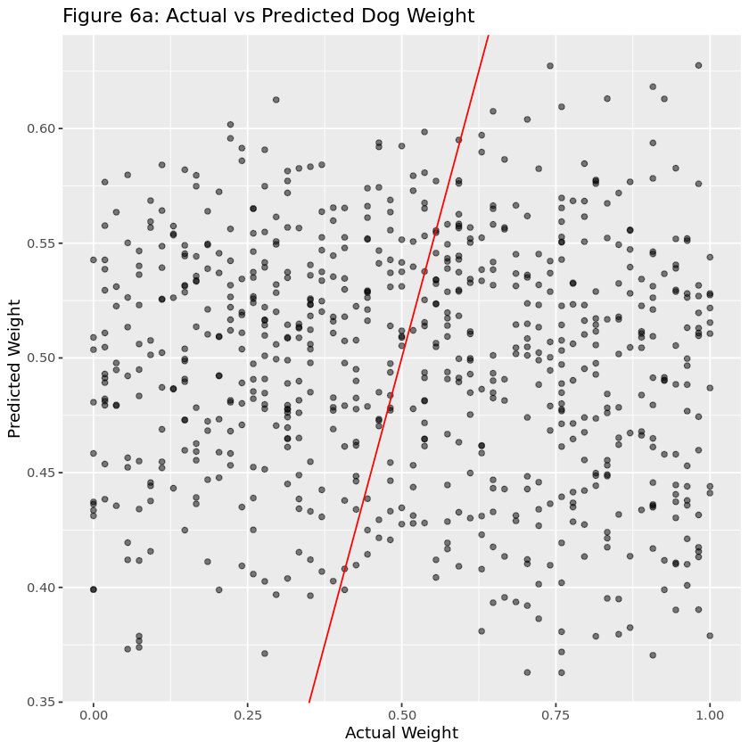
    


    
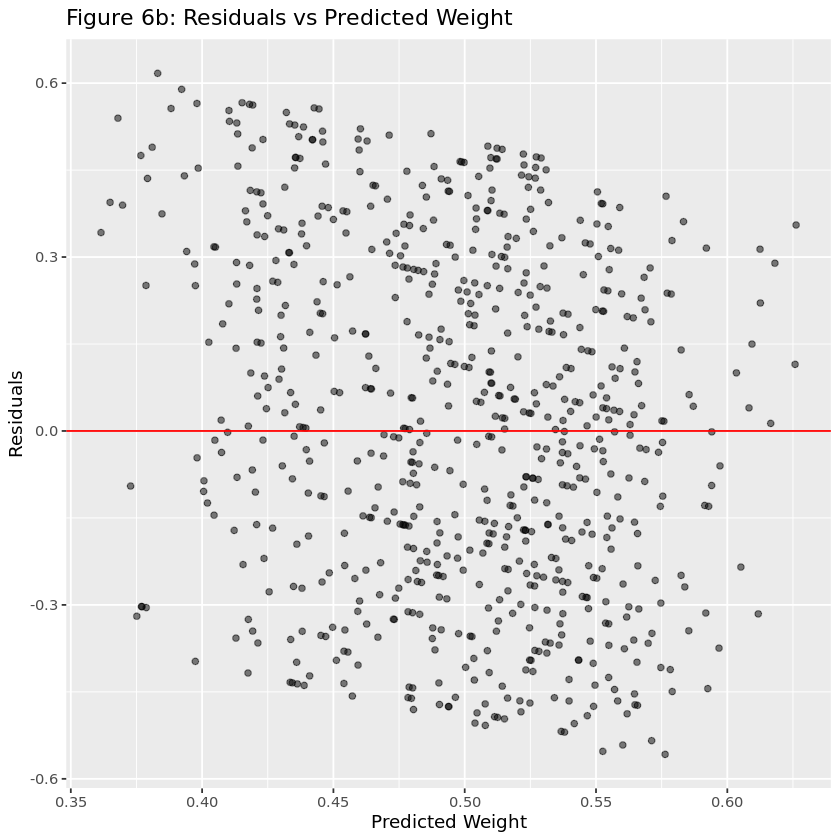
    


## 4. Figure Conclusions 

### 4.1 Figure 1: Age and Weight Distribution
Figure 1a: Distribution of Dog Ages (Years)
This histogram displays the frequency distribution of dogs’ ages (in years). The data span from 1 to 14 years, with most dogs clustered around the median of 8 years. The unimodal shape suggests a relatively balanced sample with no strong age bias, though there may be fewer very young or very old dogs represented.

Figure 1b: Distribution of Dog Weight (kg)
This histogram shows the distribution of dog weights (in kilograms). Weights range from 5 to 59 kg, with a concentration around the median of 33 kg. The right tail indicates the presence of heavier breeds, implying moderate right-skewness in the population weight distribution.

### 4.2 Figure 2: Age VS. Weight Scatterplot
This scatter plot explores the relationship between dog age and weight. The cloud of points indicates no strong linear correlation; heavier dogs appear across most age groups. However, some clustering may occur for medium-weight dogs around ages 5–10, typical of adult life stages.

### 4.3 Figure 3: PCA 
The first two principal components capture all variance, confirming that the two numeric features (Age and Weight) are sufficient to describe the dataset’s linear structure. PC1 captures the inverse relationship between age and weight, while PC2 captures their simultaneous variation.

Figure 3a: PCA of Dogs Dataset (Gender): There is no visible separation between male and female dogs in the PCA space. Both genders overlap entirely across the two principal components. This suggests that Age and Weight distributions are similar between genders, meaning there is no strong gender-based pattern in these features.

Figure 3b: PCA of Dogs Dataset (Color): Similar to the gender PCA, dogs of all coat colors are distributed throughout the PCA space without clear groupings. This implies that color is not correlated with either age or weight — these physical attributes are independent of coat color in the dataset.

Figure 3c: PCA of Dogs Dataset (Breed) There is still a large degree of overlap between breeds, though some mild clustering can be observed for certain breeds. This overlap suggests that age and weight alone do not fully distinguish breeds, though some breeds may occupy characteristic ranges (e.g., larger or smaller dogs).
To separate breeds more effectively, additional features (such as height, lifespan, or body measurements) would likely be needed.

### 4.4 Figure 4: t-SNE
Figure 4a: t-SNE of Dogs Dataset (Color): The plot shows that color does not appear to form distinct clusters in the t-SNE space — dogs of different colors are well mixed. This suggests that coat color is not strongly correlated with the other features in the dataset (e.g., breed, size, or weight). Color variation is likely distributed across multiple breeds and characteristics rather than being a defining or separating feature.

Figure 4b: t-SNE of Dogs Dataset (Gender): Male and female dogs are distributed almost evenly across the entire space. There are no clear separations or clusters based on gender. This implies that gender has little to no influence on the combination of features that define similarity between dogs in the dataset.

Figure 4c: Some clustering by breed can be observed — certain groups of points appear to be more tightly clustered. This indicates that breed is a stronger factor influencing the dogs’ features (such as weight, height, or other attributes). However, there is still some overlap between breeds, which may reflect similarities between certain types of dogs or mixed-breed individuals.

### 4.5 Figure 5: Kmeans
The figure shows a scatter plot with Age vs. Weight, with dogs grouped into three clusters identified by K-means clustering.

Cluster 1 (red) represents heavier dogs (likely large breeds).
Cluster 2 (green) represents lighter dogs.
Cluster 3 (blue) represents medium-weight dogs.

Age does not strongly separate the clusters — the key distinction appears to be driven by weight, suggesting that weight alone captures much of the natural grouping among dogs.

### 4.6 Figure 6: Comparison of Average Dog Weight Across Breeds
Figure 6a: Actual vs Predicted Dog Weight
This scatter plot compares actual vs. predicted weights from a regression model, with the red line representing the ideal 1:1 relationship (perfect predictions).
The data points are widely scattered around the red line, indicating a fair amount of prediction error. The model captures some general trends, but it struggles to predict weight precisely for individual dogs.
Possible reasons: high variability within breeds, missing predictive features, or limited training data.

Figure 6b: Residuals vs Predicted Weight
This plot shows the residuals (errors between predicted and actual weight) plotted against the predicted weight values.
The residuals appear randomly scattered around zero, without a clear pattern.
This suggests that the model’s errors are not systematically biased — a good sign of model validity. However, the spread of residuals indicates that predictions still have moderate variance, meaning the model could be improved with more features or non-linear methods.

## 5. Exploratory Questions

### 5.1 Do older dogs tend to weigh more than younger dogs stratified by breed?
Figure 2 Age vs Weight Scatterplot showed the relationship between dog age and weight. No strong linear correlation was found. To further understand the relationship between age and weight, stratifying by breed will better show the growth patterns of the dogs. 


```R
ggplot(dogs, aes(x = Age, y = Weight)) +
  geom_point(alpha = 0.6, size = 2, color = "steelblue") +
  geom_smooth(method = "lm", se = FALSE, color = "red") +
  facet_wrap(~ Breed, scales = "free_y") +
  theme_minimal(base_size = 13) +
  labs(
    title = "Age vs. Weight by Breed",
    x = "Age (years)",
    y = "Weight (kg)"
  )
```

    `geom_smooth()` using formula = 'y ~ x'


    
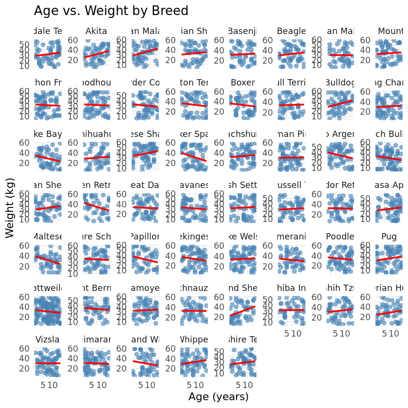
    


### 5.2 Do certain breeds have more color variation than others?
Previous analyses (Figures 3b and 4a) showed that coat color is not correlated with weight or age. However, those results did not examine the relationship between breed and color variation. It is possible that some breeds have a wider range of acceptable or naturally occurring coat colors, while others are more uniform.
To explore this question, the number of unique coat colors should be calculated for each breed and it can be visualized using a heatmap to highlight which breeds display the greatest color diversity.


```R
color_diversity <- dogs %>%
  group_by(Breed) %>%
  summarise(Color_Diversity = n_distinct(Color)) %>%
  arrange(desc(Color_Diversity))
print(color_diversity, n=53)

#Heatmap
ggplot(color_diversity, 
       aes(x = "", 
           y = reorder(Breed, Color_Diversity), 
           fill = Color_Diversity)) +
  geom_tile(color = "white", height = 0.8) +
  scale_fill_gradient(low = "lightyellow", high = "firebrick") +
  theme_minimal(base_size = 13) +
  labs(
    title = "Heatmap of Coat Color Diversity Across Breeds",
    x = NULL,
    y = "Breed",
    fill = "Unique Colors"
  ) +
  theme(
    axis.text.x = element_blank(),
    axis.ticks.x = element_blank(),
    axis.text.y = element_text(size = 9),
    plot.title = element_text(face = "bold", hjust = 0.5)
  )
```

    # A tibble: 53 × 2
       Breed                         Color_Diversity
       <chr>                                   <int>
     1 Airedale Terrier                           14
     2 Australian Shepherd                        14
     3 Basenji                                    14
     4 Belgian Malinois                           14
     5 Bichon Frise                               14
     6 Bloodhound                                 14
     7 Border Collie                              14
     8 Boxer                                      14
     9 Bulldog                                    14
    10 Chesapeake Bay Retriever                   14
    11 Chihuahua                                  14
    12 Chinese Shar-Pei                           14
    13 Cocker Spaniel                             14
    14 Dachshund                                  14
    15 Doberman Pinscher                          14
    16 Dogo Argentino                             14
    17 French Bulldog                             14
    18 Great Dane                                 14
    19 Jack Russell Terrier                       14
    20 Labrador Retriever                         14
    21 Lhasa Apso                                 14
    22 Miniature Schnauzer                        14
    23 Papillon                                   14
    24 Pekingese                                  14
    25 Poodle                                     14
    26 Pug                                        14
    27 Rottweiler                                 14
    28 Saint Bernard                              14
    29 Samoyed                                    14
    30 Shetland Sheepdog                          14
    31 Shih Tzu                                   14
    32 Siberian Husky                             14
    33 Vizsla                                     14
    34 Whippet                                    14
    35 Akita                                      13
    36 Alaskan Malamute                           13
    37 Beagle                                     13
    38 Boston Terrier                             13
    39 Bull Terrier                               13
    40 Cavalier King Charles Spaniel              13
    41 Havanese                                   13
    42 Maltese                                    13
    43 Pembroke Welsh Corgi                       13
    44 Pomeranian                                 13
    45 Schnauzer                                  13
    46 Shiba Inu                                  13
    47 Weimaraner                                 13
    48 West Highland White Terrier                13
    49 German Shepherd                            12
    50 Golden Retriever                           12
    51 Irish Setter                               12
    52 Yorkshire Terrier                          12
    53 Bernese Mountain Dog                       11


    
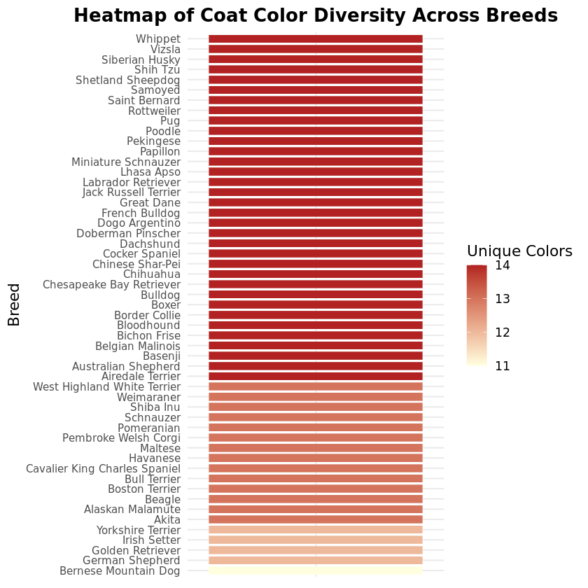
    


### 5.3 Are certain breeds heavier than other breeds?
Figures 3c and 4c indicate that breed may play a stronger role in explaining variation in weight. Mild clustering by breed was observed in both the PCA and t-SNE plots, suggesting that dogs of similar breeds tend to share comparable size profiles.

To investigate this relationship more directly, the distribution of weights across breeds could be examined using summary statistics and a boxplot. This analysis helps clarify whether certain breeds are consistently heavier or lighter than others, and whether breed type can meaningfully account for differences in body weight.


```R
# Calculate mean and SD of weight per breed
breed_weights <- dogs %>%
  group_by(Breed) %>%
  summarise(
    Mean_Weight = mean(Weight, na.rm = TRUE),
    SD_Weight = sd(Weight, na.rm = TRUE),
    Count = n()
  ) %>%
  arrange(desc(Mean_Weight))
print(breed_weights, n = 53)

# Boxplot of Weight by Breed
ggplot(dogs, aes(x = reorder(Breed, Weight, median), y = Weight, fill = Breed)) +
  geom_boxplot(show.legend = FALSE, alpha = 0.8) +
  coord_flip() +
  theme_minimal(base_size = 13) +
  labs(
    title = "Distribution of Dog Weight Across Breeds",
    x = "Breed",
    y = "Weight (kg)"
  )
```

    # A tibble: 53 × 4
       Breed                         Mean_Weight SD_Weight Count
       <chr>                               <dbl>     <dbl> <int>
     1 Chinese Shar-Pei                     38.2      14.0    64
     2 Golden Retriever                     35.5      16.5    44
     3 Miniature Schnauzer                  35.3      15.1    55
     4 Alaskan Malamute                     34.6      14.9    55
     5 Bulldog                              34.6      14.8    55
     6 Pembroke Welsh Corgi                 34.5      14.7    67
     7 Saint Bernard                        34.3      14.3    54
     8 Bull Terrier                         34.2      16.0    55
     9 Dachshund                            33.9      14.8    59
    10 Dogo Argentino                       33.7      15.5    55
    11 Pug                                  33.6      17.3    65
    12 Poodle                               33.5      15.4    61
    13 Australian Shepherd                  33.4      16.4    51
    14 Pekingese                            33.3      16.2    68
    15 Bernese Mountain Dog                 33.3      16.4    56
    16 Irish Setter                         33.1      16.9    55
    17 Shih Tzu                             33.1      15.7    52
    18 Boston Terrier                       33.0      18.5    53
    19 Samoyed                              33.0      13.8    56
    20 Whippet                              32.7      15.2    60
    21 Schnauzer                            32.6      14.2    45
    22 Great Dane                           32.6      15.6    54
    23 Beagle                               32.5      15.6    55
    24 Bloodhound                           32.3      17.0    59
    25 Pomeranian                           32.2      14.4    48
    26 Boxer                                32.2      15.7    52
    27 Papillon                             32.1      16.9    48
    28 Cocker Spaniel                       32.1      18.3    59
    29 Bichon Frise                         32.0      15.7    64
    30 Basenji                              31.9      17.3    49
    31 Labrador Retriever                   31.9      15.8    52
    32 German Shepherd                      31.9      15.3    53
    33 Airedale Terrier                     31.8      14.0    55
    34 Akita                                31.7      14.4    51
    35 Havanese                             31.6      16.2    55
    36 Shiba Inu                            31.5      13.5    45
    37 Maltese                              31.3      13.7    52
    38 Rottweiler                           30.7      15.8   118
    39 Border Collie                        30.5      15.9    57
    40 Chihuahua                            30.2      16.0    48
    41 Cavalier King Charles Spaniel        30.2      15.5    64
    42 Shetland Sheepdog                    30.2      16.5    50
    43 Doberman Pinscher                    30.1      16.6    66
    44 Vizsla                               30.0      15.1    64
    45 Lhasa Apso                           29.9      15.8    56
    46 Weimaraner                           29.9      14.4    66
    47 Jack Russell Terrier                 29.5      14.8    55
    48 West Highland White Terrier          29.5      18.1    48
    49 Yorkshire Terrier                    29.5      14.2    53
    50 Belgian Malinois                     29.1      15.3    44
    51 French Bulldog                       29.0      15.2    70
    52 Chesapeake Bay Retriever             28.2      15.0    52
    53 Siberian Husky                       28.2      15.9    53


    
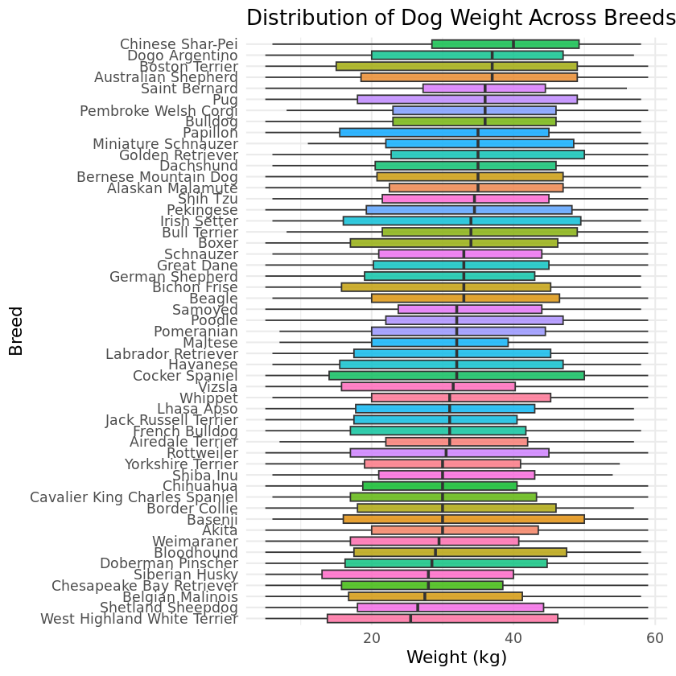
    

